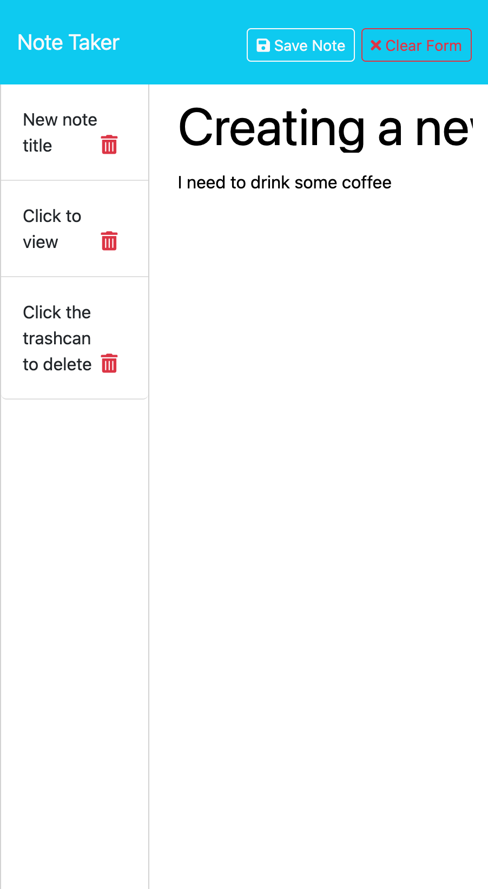

# Note Taker #
##  By Peter Martin

## Table of Contents
  1.[Application Description](#description) 
  2.[Usage](#usage) 
  3.[Installation Instructions](#installation) 
  4.[Licenses](#licensing) 
  5.[How to Contribute](#contributing) 
  6.[Contact Info](#contact) 

## Description ##
  This is a basic note taking app, where a user can create notes that are saved to a database,
  then retrieve them or delete them.

## Usage ##
  The app loads in your web browser, and from there you can click through to get to the note 
  taking portion of it. The user will create a title and text content for their note, then
  they can save that. On the left hand side of the page the saved notes appear, and they are
  clickable to load into the right hand side of the page. The user can also delete the notes to
  remove them from the page and database. 

  The application utilizes node.js and javascript to connect the front end public files to the
  back end database.

## Relevant Media ##
  

## Installation ##
  The application is deployed on Heroku and only requires an internet connection to use.
  To run the application on your local system you need to have express, inquirer, and node
  installed.

## Licensing
  This application is licensed by MIT. 
   
  [MIT License](https://opensource.org/licenses/MIT)

## Works Cited ##
  Webdocs from MDN, W3Schools, Node.js

## Contributing
  Reach out me if you'd like to contribute!

## Contact
  Reach me at [GitHub](https://github.com/pm-912)  or  <a href = "mailto:peterleemartin@gmail.com" > Email</a>
